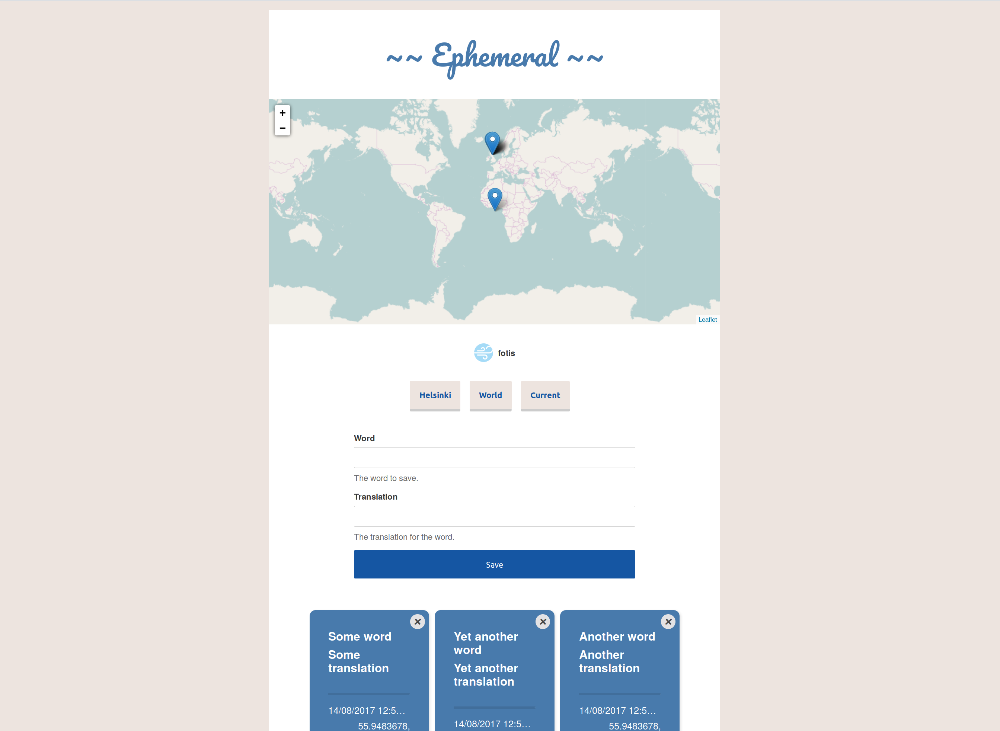

# Ephemeral 🍃

Ephemeral is a progressive web app for writing down cards, tracking time added and location.
The original motivation was writing down words and their translations as I encounter them, when travelling or moving to a new city.
I also wanted to be able to access my notes easily, see relevant data, and be able to extend visualisations programatically.

Ephemeral is mostly written in [Elm](http://elm-lang.org), with maps from [Leaflet](http://http://leafletjs.com/) and storage via [PouchDB](https://pouchdb.com/).
It works offline and can synchronise your data!



## Features
- [X] Write down notes
- [X] Works offline
- [X] You can add it to your home screen on Android
- [X] Notes can be synchronised to a remote database, and across devices
- [X] Export to Anki deck

## Development: Frontend
Webpack is used to bundle everything on the front-end. You can run it with:
```shell
npm install
npm run dev
```

Change files in `src/` as appropriate

Generally, if you need to handle PouchDB and Leaflet maps, use the Javascript side.
For UI rendering and logic, prefer Elm and synchronise over ports as appropriate
There is a mix of JS (used to handle PouchDB, Leaflet maps) in `src/index.js`, which should probably be restructured soon.

## Production: Frontend
```shell
npm run prod
```
... and your files should be bundled in `dist/`.
Deploy `dist/` with your favourite static vendor.

Webpack PWA and Webpack offline customisation

## PWA, Offline Data
A Progressive Web App works offline via a Service Worker, which caches assets and scripts.
- Currently, Service Workers do not work in Safari, so the app won't load offline :/
- If you are on Chrome or Firefox, then the app will load offline
- Furthermore, if you are on Android, you can add the app to your home screen, and it will launch independently

For storage, Ephemeral uses PouchDB, which is a local, persisted database in your browser.
PouchDB can sync to a remote database for backup, since the local IndexedDB/WebSQL (which PouchDB uses) can still be cleared on occasion.
**By default, if a user is not logged in, the local PouchDB does not synchronise anywhere.**

Service workers are generated with the [webpack-offline plugin](https://github.com/NekR/offline-plugin)

An app manifest is generated with [webpack-manifest-plugin](https://github.com/danethurber/webpack-manifest-plugin)

If you want to learn more about Progressive Webapps, [here is an intro by
Google](https://developers.google.com/web/progressive-web-apps/).

## Development DB
You can either use a local CouchDB, but perhaps it is *simpler if you use the node `pouchdb-server` in development*.

```shell
npm i -g pouchdb-server
npm run pouchdb-server
```

By default, pouchdb-server will be run on port 5984 (a default), but you can specify which one it is in `package.json`.
Similarly, you can specify the url and database in `config/development.js` and `config/production.js`.
For production, you only need specify the URL, since the database changes per user (See `Production DB` below)

### Dev users
#### Via Config
You can manually create an admin user by creating and editing `pouchdb-server/config.json`

```json
{
  "admins": {
    "dev": "123"
  }
}
```
Note that the file will be overwritten with a hash by the server once run.

#### Via Fauxton
Alternatively (perhaps easier), you can navigate to `http://localhost:5984/_utils` (or whatever the pouchdb-server URL is), to access the management interface.
- Click on `Admin Party`
- You will be prompted to create an admin user
- You can then add users as you wish via the _users table.

## Production DB
It is best if you use CouchDB for production. You have the option of self-installing or using a service like Cloudant. I went with self-hosting; see below for pointers.

### Couch-per-user
A common strategy in CouchDB is to isolate databases per user, such that they can access and replicate only their documents.
This might sound daunting, but databases in CouchDB are more lightweight document collections than you'd think.

To achieve this, we use the `couch-per-user` erlang plugin, which is simple to install.
If you can't locate your CouchDB plugin folder, then check `/etc/couchdb/default.ini`.

Couch-per-user creates datbases of the kind userdb-{hex of username}, so `index.js` has `initDB()` to make this transformation.
If you use a different scheme, change the code in `initDB()` as appropriate!

[More info on authentication recipes](https://github.com/pouchdb-community/pouchdb-authentication#couchdb-authentication-recipes)

### Self-hosting CouchDB
#### Nutshell
In case you want to self-host with SSL, here are the basic steps:

[Basics Guide](https://www.digitalocean.com/community/tutorials/how-to-install-couchdb-and-futon-on-ubuntu-14-04)
  - Get a VPS, I went with Ubuntu 16.04 on Digital Ocean
  - Install CouchDB (Ubuntu has a ppa)
  - Secure installation with custom user
  - Disable Admin-Party

Open to the world
  - Access `local.ini` or config via the web interface (forwarded over SSL per guide above), and change the bind address to the server's IP.
  - You can no longer access over the tunnel but `http://ipaddress:5984/_utils` should do it
  - Try `http://ipaddress:5984/_utils/fauxton/` if you want a cleaner interface

DNS, [Letsencrypt, SSL listening](http://verbally.flimzy.com/configuring-couchdb-1-6-1-letsencrypt-free-ssl-certificate-debian-8-jessie/) (you will have to change the addresses as appropriate)
  - Configure DNS to point to your server
  - Provision certificate; letsEncrypt needs a web server to verify ownership
  - Set up CouchDB's SSL termination
  - (Optionally) disable http access
  - Try `https://domain:6984/_utils/` and see if you're good

[Couchperuser setup](https://github.com/etrepum/couchperuser)
- If you can't locate your CouchDB plugin folder, then check `/etc/couchdb/default.ini`.

[Docker](https://github.com/apache/couchdb-docker)
 - There is also a docker option, which I haven't tried, but seems good
  - ... also comes with couch-per-user installed!


